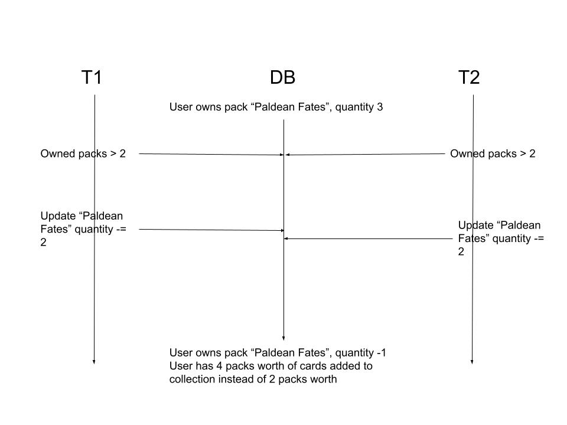
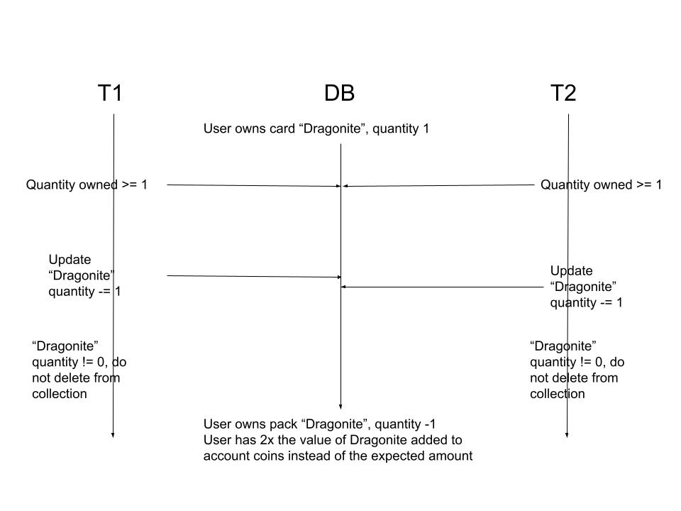
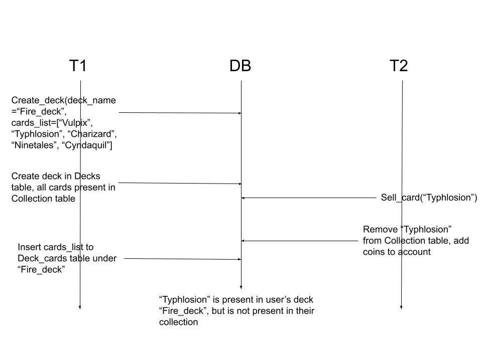

## Case 1:
#### Scenario:
- A user owns 3 of a certain pack.
- Two identical transactions occur at around the same time, where the user attempts to open 2 of that certain pack.
- Both transactions evaluate that the user has enough packs owned to open the specified quantity, but the opening action occurs twice.
- The user ends up with a quantity of -1 in their inventory for that certain pack.

#### Phenomenon:
Phantom Read

#### Sequence Diagram:

#### Proposed solution:
This is an unlikely issue, so an optimistic concurrency control approach is better here. Record the expected resulting quantity after opening the specified number of packs beforehand, and check if the result of the update matches the expectation. If not, roll back the update and skip adding any cards to the user's collection.

## Case 2:
#### Scenario: 
- A user owns 1 of a certain card.
- Two identical transactions occur at around the same time, where the user attempts to sell their one card.
- The quantity of the card in their collection is updated to -1, and is not deleted from their collection.
- The user receives twice the number of the coins that the card is valued for.

#### Phenomenon:
Phantom Read

#### Sequence Diagram:

#### Proposed solution:
Again, this is an unlikely issue, so an optimistic concurrency control approach is better. Record the expected result for the card's quantity before updating the collections table. If the actual result is unexpected, roll back the update, and do not continue to updating the user's coins.

## Case 3:
#### Scenario: 
- Transaction 1 starts building a deck with 5 cards in the user's collection
- Transaction 2 sells one of the cards used to build the deck, removing it from the user's collection before it is inserted into the deck_cards table
- The sold card will be in the user's deck in the deck_cards table, but will not be in their collection.

#### Phenomenon:
Write Skew

#### Sequence Diagram:

#### Proposed solution:
Selling cards can cause issues in different places, so in this case a pessimistic concurrency control solution is safer. When calling create_deck, acquire a shared lock with "FOR SHARE NOWAIT" for the rows in Collection containing the specified cards, and release the lock when the deck creation is done. Sell_card should fail instantly rather than waiting if a card is being added to a deck. 
