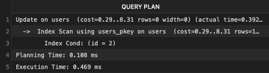

### Fake Data Modeling

File used to populate tables: [Source code](https://github.com/Sbillups0/Pokemon-Card-Collection/blob/main/src/api/populate_users.py)

Numbers following data population:

- 100,000 new fake users in the table "users"
- 1,000,000 new rows in the table "collection"--every fake user has 10 cards in their collection
- ~100,000 new rows in the table "decks"--every fake user has 1 decks (assuming that they have at least five _unique_ cards in their collection)
- ~500,000 new rows in the table "deck_cards"--every deck is composed of exactly five unique cards
- 100,000 new rows in the table "inventory"--each fake user has 1 unopened pack in their inventory
- 0-400,000 new rows in the table "display"--every fake user has 0-4 cards added to their display

While most long term users would likely have a larger collection, since opening one pack yields five cards, I wanted to achieve a reasonable amount of cards that would still enable every user to be able to use each endpoint. Since only 10 cards were available to each newly generated user, and they were not guaranteed to be unique, one deck was the only realistic possibility to create. I gave each user 1 pack just so they'd be able to utilize the endpoint to open a pack, and a normally distributed amount of coins, so they'd be able to buy another pack. I also added a random number of cards to the display so the table wouldn't be empty.

In reality, if our service was to be deployed, I'd expect a large number of users who are not very active, meaning they have a small collection. There would also exist a smaller population of users that are quite active and naturally amass a very large collection. When creating these fake users, I decided to strike a balance between these two user groups. It also would have been possible to add a randomized number of cards to each user's collection based on a skewed probability distribution.

### Performance Results

Note: The ms fluctuated during testing, so I based the result on the average from several attempts.

- Inventory Audit: 30.82 ms
- User Registration: 16.52 ms
- Get User Profile: 13.05 ms
- Get Recommended Pack: 23.22 ms
- Open Pack: 36.72 ms
- Purchase Pack: 30.01 ms
- Create Deck: 52.15 ms
- Get User Decks: 38.61 ms
- Get Card Types: 16.98 ms
- Get Total Collection Value: 23.07 ms
- Get Collection By Type: 28.20 ms
- Get Full Collection: 14.41 ms
- Get All Cards: 30.47 ms
- Get Card By Name: 22.76 ms
- Sell Card By Name: 129.30 ms
- Add To Display: 33.30 ms
- Get Pack Catalog: 17.00 ms

Longest Endpoint: Sell Card By Name

## Performance tuning and adding indexes

### Based on Sell Card By Name

```SQL
EXPLAIN ANALYZE SELECT id, price FROM cards WHERE LOWER(name) = LOWER('achang}T{N');
```


```SQL
EXPLAIN ANALYZE SELECT 1 FROM display WHERE user_id = 2 AND card_id = 39;
```


```SQL
EXPLAIN ANALYZE SELECT d.id FROM deck_cards dc JOIN decks d ON dc.deck_id = d.id WHERE d.user_id = 2 AND LOWER(dc.card_name) = LOWER('achang}T{N');
```


It appears that this is the cause for making the query slow.
After adding an index

```SQL
CREATE INDEX idx_decks_user_id ON decks (user_id);
```

Execution Time is faster:


```SQL
EXPLAIN ANALYZE SELECT quantity FROM collection WHERE user_id = 2 AND card_id = 39;
```


```SQL
EXPLAIN ANALYZE
UPDATE collection
SET quantity = quantity - 1
WHERE user_id = 2 AND card_id = 39 AND quantity >= 1
RETURNING quantity;
```


```SQL
EXPLAIN ANALYZE
DELETE FROM collection
WHERE user_id = 2 AND card_id = 39;
```


```SQL
EXPLAIN ANALYZE
UPDATE users SET coins = coins + 40 WHERE id = 2;
```



Added Indexes:

- CREATE INDEX idx_decks_user_id ON decks (user_id);
- CREATE INDEX idx_cards_lower_name ON cards (LOWER(name));
- CREATE INDEX idx_deck_cards_lower_name ON deck_cards (LOWER(card_name));

Post-Index Performance:

- Sell Card By Name: Improved from 129.30 ms → Completed in 26.45 ms (after adding indexes)
